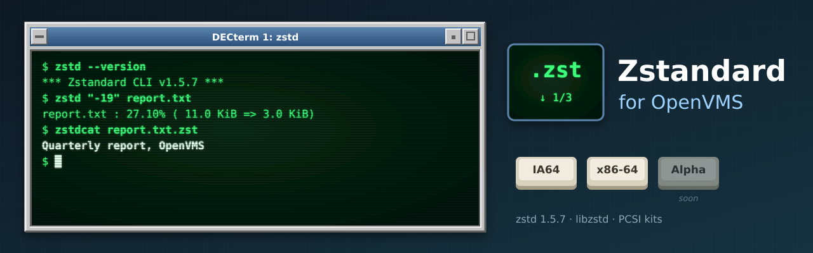

<p align="center">
  
</p>

# Zstandard for OpenVMS

[](https://github.com/issinoho/vms-zstd/releases)

[Zstandard](https://facebook.github.io/zstd/) (**1.5.7**), the zstd compressor and the libzstd
library, built natively for OpenVMS on **IA64** and **x86-64**, following its own releases. It
belongs to the same family as [GNU grep](https://github.com/issinoho/vms-grep),
[GNU sed](https://github.com/issinoho/vms-sed), [GNU awk](https://github.com/issinoho/vms-awk),
[GNU make](https://github.com/issinoho/vms-make),
[GNU diffutils](https://github.com/issinoho/vms-diffutils),
[GNU patch](https://github.com/issinoho/vms-patch), [GNU m4](https://github.com/issinoho/vms-m4),
[GNU Bison](https://github.com/issinoho/vms-bison), [flex](https://github.com/issinoho/vms-flex),
[GNU Wget](https://github.com/issinoho/vms-wget), [curl](https://github.com/issinoho/vms-curl),
[PCRE2](https://github.com/issinoho/vms-pcre2), [zlib](https://github.com/issinoho/vms-zlib),
[bzip2](https://github.com/issinoho/vms-bzip2), [XZ Utils](https://github.com/issinoho/vms-xz)
and [MariaDB](https://github.com/issinoho/vms-mariadb) for OpenVMS.

This repository holds **only our changes**: every build starts from the signed release tarball (the
Zstandard release signing key, pinned in `keys/`), applies our patches and adds our VMS files. zstd
has no configure; `tools/gen_sources.py` lists the sources zstd's own makefiles use, and MMS builds
them.

## Status

**Released: [v1.5.7-vms1](https://github.com/issinoho/vms-zstd/releases/tag/v1.5.7-vms1).**

| | IA64 (OpenVMS V8.4-2L3, VSI C 7.4) | x86-64 (OpenVMS E9.2-4, VSI C 7.7) |
|---|---|---|
| Builds | yes | yes |
| Smoke test: upstream's golden files (golden-decompression frames decompress, golden-decompression-errors are errors, golden-compression inputs round-trip at -1, -3 and -19), text and binary round trips, `zstd -l`, a `/NAMES=UPPERCASE` program linking with `LIBZSTD.OLB`, error statuses | 10/10 | 10/10 |
| Kit install, smoke test on the installed kit, remove | clean | clean |
| PCSI kit (`ZSTD`, `V1.5-7E1`) | `ISSINOHO-I64VMS-ZSTD-V0105-7E1-1.PCSI` | `ISSINOHO-X86VMS-ZSTD-V0105-7E1-1.PCSI` |

## Installing the kit

Download the kit for your architecture from the
[latest release](https://github.com/issinoho/vms-zstd/releases/latest) and check it against the
release's `SHA256SUMS`. A kit downloaded through a non-VMS system loses its record format, so
restore that first, then install it:

```
$ SET FILE/ATTRIBUTE=(RFM:FIX,LRL:8192,MRS:8192,RAT:NONE) ISSINOHO-*-ZSTD-V0105-7E1-1.PCSI
$ PRODUCT INSTALL ZSTD /PRODUCER=ISSINOHO /SOURCE=dev:[dir]
$ @ZSTD$ROOT:[000000]ZSTD$SETUP.COM
$ zstd file.txt
```

It installs `zstd` in `[ZSTD.BIN]`, `LIBZSTD.OLB` (libzstd) in `[ZSTD.LIB]`, `ZSTD.H`,
`ZSTD_ERRORS.H` and `ZDICT.H` in `[ZSTD.INCLUDE]`, `ZSTD$SETUP.COM`, the documentation and
`README.VMS` in `[ZSTD.DOC]`, and `SYS$STARTUP:ZSTD$STARTUP.COM`, which defines `ZSTD$ROOT` (add it
to `SYS$MANAGER:SYSTARTUP_VMS.COM`). `PRODUCT REMOVE ZSTD` removes it.

## On VMS

- **Commands:** `ZSTD$SETUP.COM` defines `zstd`, `unzstd` (`zstd -d`) and `zstdcat`
  (`zstd -dc`).
- **Text files:** a VMS text file (variable-length or VFC records) is compressed as text:
  its records become LF-terminated lines, as on Unix, and decompressing gives a Stream_LF
  file with the same lines. Any other file (stream, fixed-length records: executables, kits)
  is compressed byte for byte.
- **The library:** compile with `/INCLUDE=ZSTD$ROOT:[INCLUDE]` and link with
  `ZSTD$ROOT:[LIB]LIBZSTD.OLB/LIBRARY`. It is compiled `/NAMES=(AS_IS,SHORTENED)` and its
  headers declare the API so, so programs compiled with any `/NAMES` link with it.
- **File names** such as `file.txt.zst` need an ODS-5 disk.
- **Exit status:** a failed run has error severity under DCL, so `ON ERROR` works; under a
  GNV shell, `$?` is the exit code as on Unix.
- **Upper-case options in batch jobs:** under the TRADITIONAL DCL parse style unquoted
  options reach the program in lower case; quote them, use the long forms, or
  `$ SET PROCESS/PARSE_STYLE=EXTENDED` first.
- **Single-threaded:** no `-T`; the v0.5-v0.7 formats are still decoded.

## Patches

| Patch | Purpose |
|---|---|
| 0001 | `lib/zstd.h`, `zstd_errors.h`, `zdict.h`: the API under `#pragma names as_is, shortened`. |
| 0002 | `programs/platform.h`, `zstdcli.c`: `exit()` through `vms_exit()`; `main` ends with `exit()`. |
| 0003 | `programs/fileio.c`, `util.c`: read a text file (variable-length or VFC records) as text, with its size unknown (its size on disk counts record lengths). |
| 0004 | `lib/common/cpu.h`: no `cpuid` through GNU inline assembler on VMS (VSI C on x86-64 cannot compile it); built with `DYNAMIC_BMI2=0`. |

## How to build

Set up `tools/nodes.conf` as described in
[vms-grep's README](https://github.com/issinoho/vms-grep#2b-build-on-vms-from-the-host-over-ssh).
The smoke tests compare files with VSI Perl.

```sh
git clone https://github.com/issinoho/vms-zstd.git
cd vms-zstd
tools/prepare.sh            # fetch + verify, patch, MMS lists, kit inputs
tools/build.sh ia64         # upload, then @[.VMS]BUILD on the node (MMS)
tools/test.sh ia64          # smoke test
tools/kit.sh ia64           # PCSI kit -> out/kits/
```

## Roadmap

1. Link this library into the other ports where they can use it (Wget, curl).
2. Offer the patches upstream.
3. A port to OpenVMS **Alpha**.

The family of ports, all for IA64 and x86-64 (MariaDB: x86-64 only), each following its upstream releases:

| Port | Latest release | |
|---|---|---|
| GNU grep — [vms-grep](https://github.com/issinoho/vms-grep) | [v3.12-vms3](https://github.com/issinoho/vms-grep/releases/tag/v3.12-vms3) | with `grep -P` through PCRE2 |
| PCRE2 — [vms-pcre2](https://github.com/issinoho/vms-pcre2) | [v10.49-vms1](https://github.com/issinoho/vms-pcre2/releases/tag/v10.49-vms1) | the regular-expression library |
| GNU sed — [vms-sed](https://github.com/issinoho/vms-sed) | [v4.10-vms1](https://github.com/issinoho/vms-sed/releases/tag/v4.10-vms1) | the stream editor |
| GNU awk (gawk) — [vms-awk](https://github.com/issinoho/vms-awk) | [v5.4.1-vms1](https://github.com/issinoho/vms-awk/releases/tag/v5.4.1-vms1) | built with gawk's own VMS port |
| zlib — [vms-zlib](https://github.com/issinoho/vms-zlib) | [v1.3.2-vms1](https://github.com/issinoho/vms-zlib/releases/tag/v1.3.2-vms1) | the compression library |
| bzip2 — [vms-bzip2](https://github.com/issinoho/vms-bzip2) | [v1.0.8-vms1](https://github.com/issinoho/vms-bzip2/releases/tag/v1.0.8-vms1) | the bzip2 compressor and libbz2 |
| XZ Utils — [vms-xz](https://github.com/issinoho/vms-xz) | [v5.8.4-vms1](https://github.com/issinoho/vms-xz/releases/tag/v5.8.4-vms1) | xz and liblzma |
| **Zstandard** (this port) — [vms-zstd](https://github.com/issinoho/vms-zstd) | [v1.5.7-vms1](https://github.com/issinoho/vms-zstd/releases/tag/v1.5.7-vms1) | zstd and libzstd |
| curl — [vms-curl](https://github.com/issinoho/vms-curl) | [v8.22.0-vms2](https://github.com/issinoho/vms-curl/releases/tag/v8.22.0-vms2) | alongside VSI's curl kit, following curl's own releases |
| GNU Wget — [vms-wget](https://github.com/issinoho/vms-wget) | [v1.25.0-vms2](https://github.com/issinoho/vms-wget/releases/tag/v1.25.0-vms2) | the web retriever |
| GNU m4 — [vms-m4](https://github.com/issinoho/vms-m4) | [v1.4.21-vms1](https://github.com/issinoho/vms-m4/releases/tag/v1.4.21-vms1) | the macro processor |
| GNU Bison — [vms-bison](https://github.com/issinoho/vms-bison) | [v3.8.2-vms2](https://github.com/issinoho/vms-bison/releases/tag/v3.8.2-vms2) | the parser generator; runs GNU m4 |
| flex — [vms-flex](https://github.com/issinoho/vms-flex) | [v2.6.4-vms1](https://github.com/issinoho/vms-flex/releases/tag/v2.6.4-vms1) | the scanner generator; runs GNU m4 |
| GNU make — [vms-make](https://github.com/issinoho/vms-make) | [v4.4.1-vms1](https://github.com/issinoho/vms-make/releases/tag/v4.4.1-vms1) | built with make's own VMS port |
| GNU diffutils — [vms-diffutils](https://github.com/issinoho/vms-diffutils) | [v3.12-vms1](https://github.com/issinoho/vms-diffutils/releases/tag/v3.12-vms1) | cmp, diff, diff3, sdiff |
| GNU patch — [vms-patch](https://github.com/issinoho/vms-patch) | [v2.8-vms1](https://github.com/issinoho/vms-patch/releases/tag/v2.8-vms1) | applies diffs |
| MariaDB — [vms-mariadb](https://github.com/issinoho/vms-mariadb) | [v11.4.13-vms1](https://github.com/issinoho/vms-mariadb/releases/tag/v11.4.13-vms1) | server and clients; x86-64 only, preview |

## Artwork

`docs/images/banner.svg` and `docs/images/icon.svg` were made for this project in the style
of classic DECwindows and VT terminals, like those of its sibling ports.

## Licence

Zstandard is free software, dual-licensed under BSD and GPLv2; see `LICENSE` and `COPYING`. Our
patches and VMS files are distributed under the same terms.

OpenVMS is a trademark of VMS Software, Inc. This project is not affiliated with VMS
Software, Inc. or with the Zstandard project.
